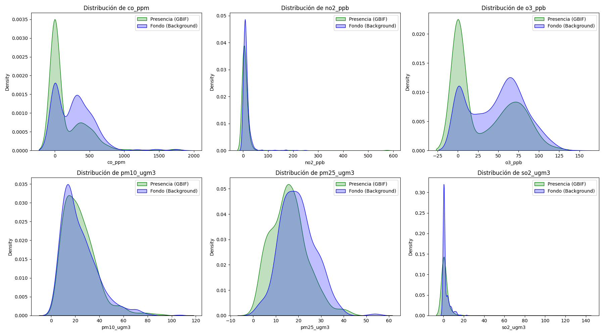

# EDA - Modelo de Presencia-Only (Golini)

Este reporte analiza el dataset final de **3457 registros**, compuesto por:
- **1480 Presencias (y=1)** provenientes de GBIF.
- **1977 Puntos de Fondo (y=0)** generados por grilla espacial.

## 1. Análisis de Cobertura (Valores Nulos)

| Contaminante | % Nulos |
|:---|:---|
| co_ppm | 60.7% |
| no2_ppb | 7.1% |
| o3_ppb | 26.6% |
| pm10_ugm3 | 53.1% |
| pm25_ugm3 | 75.5% |
| so2_ugm3 | 57.7% |

## 2. Estadísticas Descriptivas por Grupo
| level_0   | level_1   |          0 |            1 |
|:----------|:----------|-----------:|-------------:|
| co_ppm    | median    | 287.5      |   0.818622   |
| co_ppm    | std       | 274.982    | 275.885      |
| no2_ppb   | median    |   9.32308  |   5.79       |
| no2_ppb   | std       |  19.5831   |  30.9922     |
| o3_ppb    | median    |  52.9      |  11.6667     |
| o3_ppb    | std       |  33.3473   |  36.6024     |
| pm10_ugm3 | median    |  19.9114   |  21.1958     |
| pm10_ugm3 | std       |  14.7808   |  14.0782     |
| pm25_ugm3 | median    |  19.2173   |  15.2778     |
| pm25_ugm3 | std       |   7.74332  |   7.97553    |
| so2_ugm3  | median    |   0.495284 |   0.00320571 |
| so2_ugm3  | std       |   3.22051  |   8.74059    |

## 3. Visualización de Distribuciones

## 4. Mapa Interactivo
Se ha generado un mapa interactivo con Folium en: [presence_only_map.html](plots/presence_only_map.html)