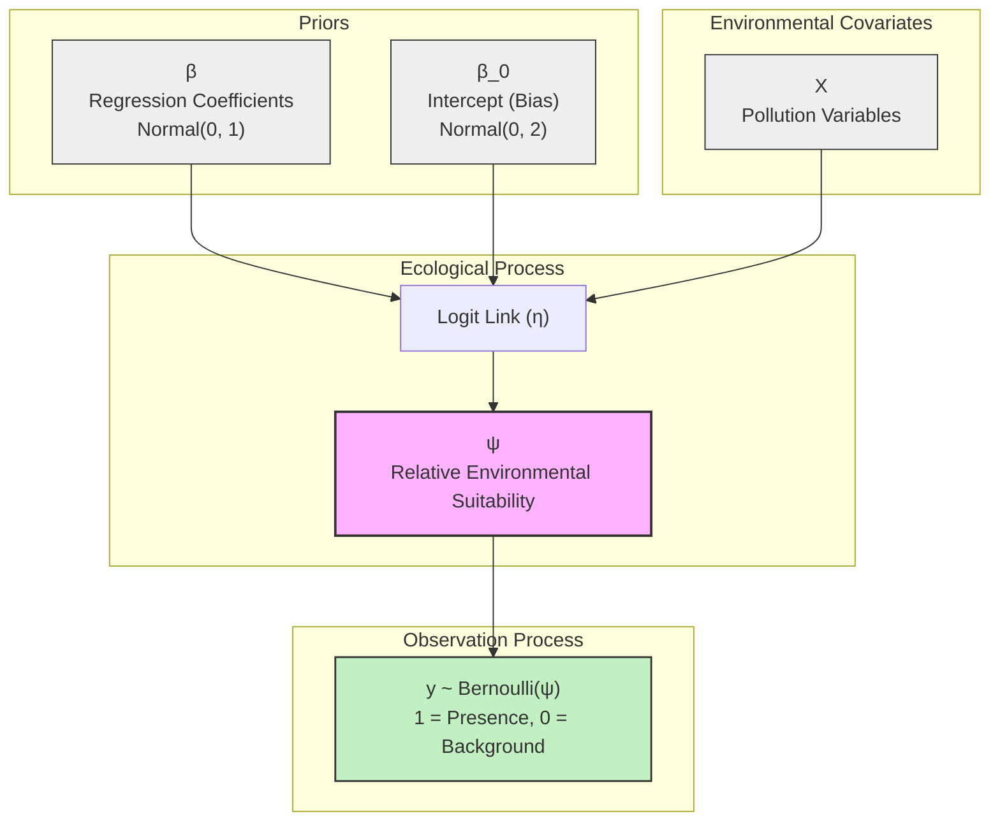

# 🦜 Proyecto: Modelo Bayesiano de Presencia-Only para el Copetón en Bogotá

> **Especie objetivo**: *Zonotrichia capensis* (Copetón / Rufous-collared Sparrow)
> **Metodología**: Modelo Bayesiano de Presencia-Only — Enfoque Golini (Tesis Doctoral, N. Golini)
> **Fuente de aves**: GBIF (Global Biodiversity Information Facility)
> **Fuente de contaminación**: Red de Monitoreo de Calidad del Aire de Bogotá (RMCAB) vía OpenAQ

---

## 🎯 Objetivo del Proyecto

Estimar cómo los niveles de **contaminación del aire** en Bogotá afectan la **presencia espacial** del Copetón (*Zonotrichia capensis*), la especie de ave urbana más común de la ciudad, utilizando únicamente **datos de presencia** (sin datos de ausencia real confirmada), bajo un marco estadístico **Bayesiano jerárquico**.

---

## 🧠 ¿Por qué "Presence-Only"? El Problema Fundamental

### El problema con los datos de GBIF

GBIF agrega registros de museos, colecciones científicas, iNaturalist, eBird y otras fuentes de ciencia ciudadana. La característica clave es que **solo se registra cuando alguien vio el ave**, nunca cuando alguien fue a un lugar y no la vio. Esto genera un tipo de dato que en estadística se llama **dato censurado** o **presencia-only**.

```
¿El copetón no fue registrado en X lugar?
    ↳ ¿Porque realmente no estaba? (ausencia biológica real)
    ↳ ¿O porque nadie fue a mirarlo? (sesgo de muestreo)
```

Responder esta pregunta con certeza es **imposible** con datos de GBIF. Intentar usar estos datos como si tuvieran "ausencias" introduce un sesgo estadístico catastrófico en cualquier modelo convencional de regresión logística.

---

## 📐 Metodología: Modelo Bayesiano de Presencia-Only (Golini)

### Referencia Principal

> Golini, N. (2013). **"Bayesian Modeling of Presence-Only Data"**. PhD Thesis, Università degli Studi di Roma "La Sapienza".

### 1. Marco Conceptual: El Diseño Caso-Control

El corazón de la metodología es reformular el problema de presence-only como un **diseño presence-background**:

| Concepto Clínico | Analogía Ecológica |
|:---|:---|
| Casos (enfermos) | Presencias confirmadas (registros GBIF) |
| Controles (no enfermos) | Puntos de fondo (background points) |
| Factor de riesgo | Niveles de contaminación |
| Relative Suitability | Idoneidad Ambiental Relativa ($\psi$) |

La clave técnica es que los puntos de fondo no son "ausencias verdaderas", sino muestras representativas del espacio ambiental (y temporal) disponible en Bogotá. 

### 2. El Modelo Estadístico

Sea:
- $y_i = 1$ si el punto $i$ es una **presencia confirmada** (GBIF)
- $y_i = 0$ si el punto $i$ es un **punto de fondo** (background point)
- $\mathbf{x}_i$ el vector de covariables ambientales (contaminantes estandarizados)

El modelo asume que $y_i \sim \text{Bernoulli}(\psi_i)$, donde la probabilidad de ser un caso (intensidad relativa) está mediada por un enlace logístico:

$$\text{logit}(\psi_i) = \beta_0 + \beta_{PM10} \cdot PM10_i + \beta_{O3} \cdot O3_i + \beta_{NO2} \cdot NO2_i + \ldots$$

### 3. Las Distribuciones A Priori (Priors de Regularización)

Dado que no somos ornitólogos expertos y no queremos imponer creencias fuertes, pero necesitamos estabilidad matemática:

$$\beta_k \sim \text{Normal}(0, 1) \quad \forall k$$

Esto equivale a decir: *"Antes de ver los datos, asumimos que los contaminantes no tienen efectos absurdamente gigantes, pero dejamos que los datos determinen la dirección y magnitud exacta"*.

### 4. El Intercepto y el Sesgo de Muestreo (Sampling Bias)

En una regresión logística Presence-Background, el intercepto ($\beta_0$) absorbe la fracción de muestreo desconocida y la prevalencia implícita de la especie. Por ende, **carece de interpretación ecológica directa**.
Para mitigar el sesgo espacial de GBIF (pajareros yendo a los mismos parques), utilizamos un **Spatial-Temporal Thinning** (raleo espacio-temporal) en la construcción de la base de datos.

### DAG (Grafo Acíclico Dirigido) del Modelo


```

---

## 🗂️ Construcción de la Base de Datos

### Fuentes de Datos

| Fuente | Archivo | Descripción |
|:---|:---|:---|
| **GBIF** | `NUEVO/copeton_gbif.csv` | 44,207 registros de *Zonotrichia capensis* en Colombia |
| **RMCAB/OpenAQ** | `data/raw/bogota_pollution_hourly.csv` | Mediciones horarias de PM2.5, PM10, O3, NO2, CO, SO2 (2021-2026) |
| **Estaciones** | `data/raw/bogota_stations_coords.csv` | Coordenadas de 19 estaciones de monitoreo (13 con coordenadas válidas) |

### Pipeline de Construcción del Dataset

```
GBIF (44,207 registros Colombia)
        │
        ▼ Filtro geográfico Bogotá Urbana (lat: 4.55–4.77, lon: -74.18–-74.01)
        │
~33,874 registros en área de Bogotá estricta
        │
        ▼ Filtro temporal (2021–2026, match con datos de contaminación RMCAB)
        │
~13,608 presencias con fecha en período analizado
        │
        ▼ Corrección de sesgo: Spatial Thinning Espacio-Temporal (1 por celda/mes)
        │
~3,847 presencias únicas espacio-temporalmente
        │
        │ + Generación de Background Points (Puntos de Fondo)
        │   Método: Spatial Grid regular sobre bbox de Bogotá urbana (con reemplazo)
        │   Total generados: 7,694 puntos | Peso cuadratura: área/N
        │
        ▼ Merge espacial con 19 estaciones RMCAB (haversine)
        │   + Merge temporal por promedio diario de contaminación
        │   ✅ Cobertura estrictamente urbana (Sin Sabana Occidente ni Rural Sur/Sur-occidente)
        │
Dataset Final: copeton_presence_only_ready.csv
        │
        ├─ y = 1 → 1,480 Presencias GBIF con contaminación medida
        └─ y = 0 → 1,977 Puntos de fondo con contaminación asignada
           Total: 3,457 registros | 19 variables
        │
        ▼ Filtro model-ready: PM10 + NO2 + O3 sin nulos
copeton_presence_only_model_ready_pm10_no2_o3.csv
        ├─ y = 1 → 740 Presencias
        └─ y = 0 → 614 Puntos de fondo
           Total: 1,354 registros
```

### Sobre los Background Points: Método Estándar (Renner & Warton, 2013)

La literatura moderna de SDM (Species Distribution Modeling) trata los background points como **puntos de cuadratura** para aproximar la integral del proceso de intensidad espacial. Seguimos el estándar de:

1. **Spatial Grid Coverage**: Creamos una grilla regular sobre la *bounding box* de Bogotá (cada ~500m), garantizando cobertura uniforme del espacio ambiental disponible.
2. **Temporal Alignment**: Asignamos a cada punto de fondo una fecha y hora aleatoria dentro del rango de datos disponibles (2021-2026), para que tenga contaminación medible.
3. **Quadrature Weights**: Cada punto de fondo recibe un peso $w = A_{total} / N_{background}$ (área total / número de puntos), requerido para la correcta aproximación de la integral en el proceso de Poisson.
4. **Corrección de Sesgo (GBIF)**: Los datos de GBIF tienen sesgo de observación hacia zonas accesibles. Aplicamos **spatial thinning** previo (1 presencia por celda de 500m) para reducir la autocorrelación espacial antes de usar las presencias.

> **¿Por qué NO simplemente usar puntos aleatorios?** Los puntos completamente aleatorios no garantizan una buena cobertura del espacio ambiental y pueden sobrerepresentar zonas con alta densidad observacional (introduciendo el mismo sesgo que queremos corregir).

---

## 📊 Diccionario de Variables del Dataset Final

| Variable | Tipo | Descripción | Rol en el Modelo |
|:---|:---|:---|:---|
| **`y`** | Binaria (0/1) | 1 = presencia GBIF; 0 = punto de fondo | Variable respuesta |
| **`lat`** | Numérica | Latitud decimal | Espacial |
| **`lon`** | Numérica | Longitud decimal | Espacial |
| **`date`** | Fecha | Fecha del registro | Temporal |
| **`hour`** | Entero (0-23) | Hora redondeada del registro | Temporal |
| **`month`** | Entero (1-12) | Mes del año | Estacionalidad |
| **`nearest_station`** | Texto | Estación RMCAB más cercana | Match contaminación |
| **`distance_km`** | Numérica | Distancia a la estación (km) | Calidad del dato |
| **`pm10_ugm3`** | Numérica | Material Particulado < 10 µm | Covariable ecológica ($\beta$) |
| **`pm25_ugm3`** | Numérica | Material Particulado < 2.5 µm | Covariable ecológica ($\beta$) |
| **`o3_ppb`** | Numérica | Ozono troposférico | Covariable ecológica ($\beta$) |
| **`no2_ppb`** | Numérica | Dióxido de Nitrógeno | Covariable ecológica ($\beta$) |
| **`co_ppm`** | Numérica | Monóxido de Carbono | Covariable ecológica ($\beta$) |
| **`so2_ppb`** | Numérica | Dióxido de Azufre | Covariable ecológica ($\beta$) |
| **`quadrature_weight`** | Numérica | Peso del punto de cuadratura (0 para presencias, A/N para fondo) | Corrección IPP |
| **`source`** | Texto | `"gbif"` o `"background"` | Trazabilidad |

---

## 🔬 Coherencia Metodológica: ¿Por qué este enfoque tiene sentido?

### Comparación con el modelo anterior (eBird Occupancy)

| Aspecto | **Modelo Anterior (eBird)** | **Modelo Nuevo (GBIF Presence-Only)** |
|:---|:---|:---|
| **Fuente de aves** | eBird (checklists completas) | GBIF (registros oportunistas) |
| **Tipo de dato** | Presencia + Ausencia confirmada | Solo presencia |
| **Marco estadístico** | Occupancy model de Clark (2019) | Modelo Presence-Only de Golini |
| **Cómo maneja ausencias** | Ausencia científica real (lista completa) | Variable latente $Z_i$ (dato aumentado) |
| **Parámetro detección** | Sí ($\alpha$: esfuerzo del observador) | No (el sesgo se maneja en background) |
| **N de datos** | 910 listas completas | ~17,000+ presencias + N puntos de fondo |
| **Ventaja clave** | Ausencias confiables | Mayor volumen de datos, fuente más amplia |
| **Desventaja clave** | Requiere eBird (acceso restringido) | Prevalencia desconocida → parámetro extra |

### ¿Es coherente usar GBIF con este modelo?

**Sí, y es el match metodológico correcto.** GBIF es exactamente el tipo de base de datos para el que Golini diseñó su modelo: registros oportunistas de museos y ciencia ciudadana, sin esfuerzo de muestreo estandarizado, donde la ausencia de un registro no implica ausencia biológica. El modelo de Golini fue probado originalmente con datos de herbarios y colecciones de museos (para *Taxus baccata* en Italia) — una situación análoga a GBIF.

---

## 📁 Estructura del Proyecto

```
PROYECTOBAYESIANA-COPETON/
│
├─ 📂 NUEVO/
│   ├─ copeton_gbif.csv              ← Datos crudos de aves (44,207 registros GBIF)
│   └─ PhD_Thesis_N_Golini.pdf       ← Referencia metodológica principal
│
├─ 📂 01_data_extraction/
│   ├─ extract_station_coords.py     ← Extrae coordenadas de estaciones RMCAB
│   └─ fetch_bogota_pollution_hourly.py ← Descarga horaria de OpenAQ
│
├─ 📂 02_data_processing/
│   ├─ build_presence_only_dataset.py  ← [NUEVO] Script principal de la base
│   └─ cross_join_birds_pollution.py   ← Script heredado (referencia ebird)
│
├─ 📂 03_eda_copeton/
│   └─ ...                           ← EDA y validación del dataset final
│
├─ 📂 04_bayesian_model/
│   ├─ bayesian_model_logic.md       ← Lógica del modelo anterior (Occupancy)
│   └─ presence_only_logic.md        ← [NUEVO] Lógica del modelo Golini
│
├─ 📂 data/
│   ├─ raw/
│   │   ├─ bogota_pollution_hourly.csv   ← Mediciones horarias RMCAB 2022-2026
│   │   └─ bogota_stations_coords.csv    ← Coordenadas 19 estaciones
│   ├─ interim/
│   │   └─ birds_pollution_merged.csv    ← Merge intermedio (referencia)
│   └─ processed/
│       ├─ copeton_presence_only_ready.csv ← [OUTPUT] Dataset presence-background completo
│       └─ copeton_presence_only_model_ready_pm10_no2_o3.csv ← [OUTPUT] Dataset limpio para modelar
│
└─ README.md                         ← Este archivo
```

---

## ▶️ Cómo Reproducir el Dataset

### Requisitos

```bash
pip install pandas numpy scipy
```

### Paso 1: Generar la base de datos final

```bash
python 02_data_processing/build_presence_only_dataset.py
```

El script genera `data/processed/copeton_presence_only_ready.csv` con:
- Presencias de GBIF procesadas y corregidas por sesgo
- Puntos de fondo con sus pesos de cuadratura
- Covariables de contaminación unidas espaciotemporalmente

### Paso 2: Generar dataset limpio para modelar

```bash
python 02_data_processing/build_presence_only_modeling_dataset.py
```

El script genera `data/processed/copeton_presence_only_model_ready_pm10_no2_o3.csv` usando solo PM10, NO2 y O3, sin nulos en las covariables del modelo.

### Paso 3: Ajustar el modelo Bayesiano

```python
# Ver: 04_bayesian_model/presence_only_logic.md
# Implementación en PyMC recomendada:
# 04_bayesian_model/02_modelo_presencia_fondo_pm10_no2_o3_run_all.ipynb
```

---

## 📚 Referencias Clave

1. **Golini, N.** (2013). *Bayesian Modeling of Presence-Only Data*. PhD Thesis, Università degli Studi di Roma.
2. **Renner, I.W. & Warton, D.I.** (2013). Equivalence of MAXENT and Poisson point process models for species distribution modeling in ecology. *Biometrics*, 69(1), 274–281.
3. **Di Lorenzo, B., Farcomeni, A. & Golini, N.** (2011). A Bayesian model for presence-only semicontinuous data with application to predict the distribution of a parasitic plant.
4. **Clark, A.E.** (2019). Efficient Bayesian analysis of occupancy models with logit link functions. *Ecology and Evolution*.
5. **GBIF.org** (2024). *Zonotrichia capensis* occurrences. [https://www.gbif.org](https://www.gbif.org)

---

*Proyecto de Estadística Bayesiana — 2026*
